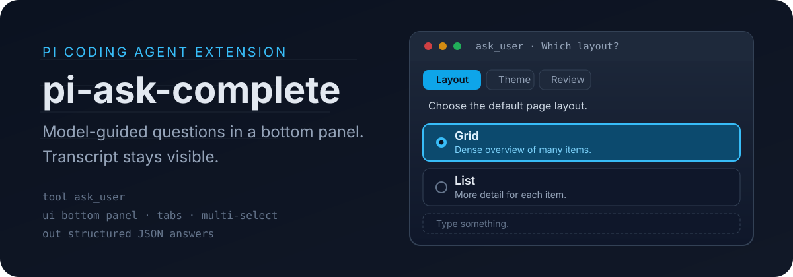

# pi-ask-complete

[](assets/readme/hero.svg)

Model-guided **`ask_user`** questions for the [Pi coding agent](https://pi.dev).

The extension tells the model to use `ask_user` for decisions, preferences, confirmations, and clarifying questions instead of dumping multiple-choice prompts into chat. Answers come back as structured JSON. The transcript stays visible the whole time.

[](assets/readme/how-it-works.svg)

---

[](assets/readme/section-features.svg)

- Single-select and multi-select questions
- Free-form answers on every question (`Type something.`)
- Optional descriptions and side-by-side previews
- Multiple questions with tabs and a final review screen
- Required or skippable questions
- Bottom-panel UI that keeps the transcript visible
- Structured JSON answers returned to the model
- Herdr attention notification when the panel waits in a background pane

---

[](assets/readme/section-install.svg)

```bash
pi install npm:@itc-steve/pi-ask-complete
```

From a local checkout:

```bash
pi install /path/to/pi-ask-complete
```

Run `/reload` after installation.

---

[](assets/readme/section-usage.svg)

```ts
ask_user({
  questions: [
    {
      header: "Which layout?",
      tab: "Layout",
      prompt: "Choose the default page layout.",
      options: [
        { label: "Grid", description: "Dense overview of many items." },
        { label: "List", description: "More detail for each item." }
      ],
      allowSkip: false
    }
  ]
})
```

Every question also includes a **Type something.** row. The tool returns structured JSON with the user's selections, custom answers, skipped questions, cancellation state, and optional note.

## License

MIT
